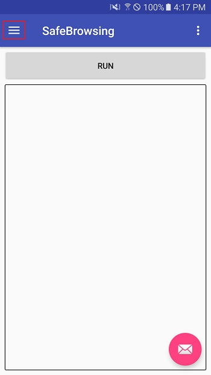
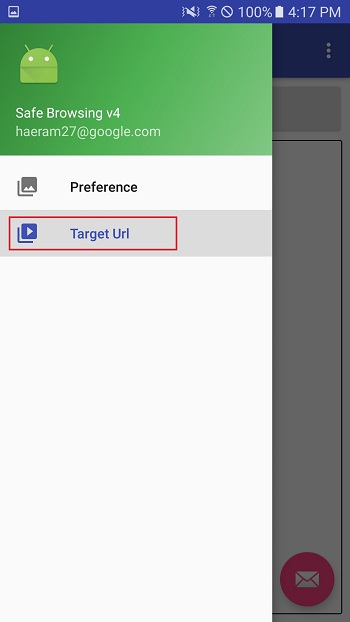

# SafeBrowsing
Android Client application using google [Safe Browsing API v4](https://developers.google.com/safe-browsing/v4/get-started)

## Prerequisite

- please specify your valid google apikey in make app/src/main/assets/apikey file before build apk
- please refer [here](https://support.google.com/cloud/answer/6158862?hl=en&ref_topic=6262490) to setup your valid google apikey

## How to lookup urls
1. open navigation bar

2. open Target Url activity

3. Init target urls - if there are no urls in box then please push "Reset" button

4. go back to main activity and push "Run" button to look up urls

